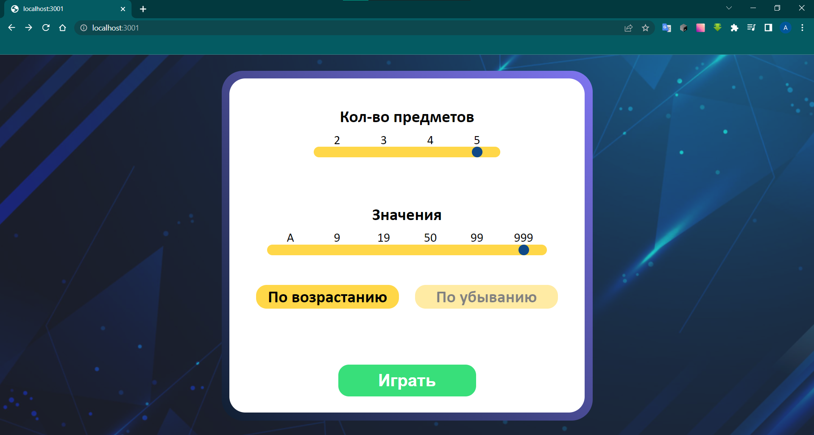
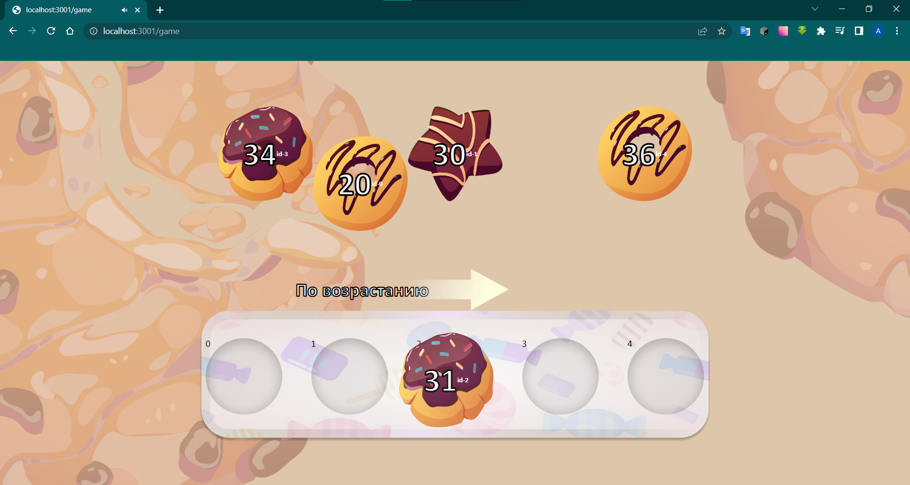

# Тестовое задание на позицию Frontend Junior Developer в компании


## Техническое задание

1. Создайте проект на основе фреймворка https://nextjs.org/
2. Установите библиотеку https://emotion.sh/docs/styled
3. Сделайте верстку страницы, используя React и styled-components
4. Используйте функциональные компоненты и TypeScript
5. Необходимо реализовать cледующий функционал: https://docs.google.com/document/d/1yf1nzE9BzusNdB15kLG9vkhtuWjtqBgVLByRvyZxz-I/edit?usp=sharing
6. Макет: https://www.figma.com/file/Ttn7siGjRcFZ0OzPbT2Xxg/Untitled?node-id=0%3A1

## Cтек:

- [Next.js](https://nextjs.org/)
- [Typescript](https://www.typescriptlang.org/)
- [Emotion](https://emotion.sh/docs/styled)

### Были использованы следующие дополнительные библиотеки:

- [React-Drag-Drop-Container](https://github.com/peterh32/react-drag-drop-container) - для управления переносимыми объектами
- [UseSound](https://github.com/joshwcomeau/use-sound) - для воспроизведение звуков игры

## О реализации и принятых решениях




##### Responsive

Сделал сайт адаптивным, минимальным экраном выбрал iPhone SE (375px ширина)

##### RadioButtons

Элементы количества предметов и значений сделал через radio buttons, область нажатия сделал больше для удобства на мобильных устройствах

##### Components

Сделал элементы управления SFButton, ButtonPicker, RadioPicker переиспользуемыми и глупыми. В будущем это может стать частью библиотеки ui

##### no State manager

Не использовал redux из-за его избыточности, в данном случае идеально подошел реактовский Context

##### Drag-and-drop

Для drag-n-drop использовал маленькую легковесную библиотеку react-drag-drop-container (https://github.com/peterh32/react-drag-drop-container)

##### Assets, constants

Ассеты храню в `/public`, конфигурация написана в constants/assets.ts. Таким образом можно легко добавлять или редактировать изображения

##### configs

Данные для первого экрана и данные параметров игры перенес в `/constants/configs.ts` . Если мы начнем получать эти данные с бэкенда, будет легко внести изменения

##### style constants

Цвета вынес в `styles/styles.ts` . Не использовал css переменные из-за того что мы пользуемся emotion

##### Modal window

Экран победы сделал модальным окном вместо отдельной страницы, потому что в макете это было сделано так.

# Спасибо за внимание проявленное к моей работе!

## Getting Started

First, run the development server:

```bash
npm run dev
# or
yarn dev
```

Open [http://localhost:3000](http://localhost:3000) with your browser to see the result.

You can start editing the page by modifying `pages/index.js`. The page auto-updates as you edit the file.

[API routes](https://nextjs.org/docs/api-routes/introduction) can be accessed on [http://localhost:3000/api/hello](http://localhost:3000/api/hello). This endpoint can be edited in `pages/api/hello.js`.

The `pages/api` directory is mapped to `/api/*`. Files in this directory are treated as [API routes](https://nextjs.org/docs/api-routes/introduction) instead of React pages.

## Learn More

To learn more about Next.js, take a look at the following resources:

- [Next.js Documentation](https://nextjs.org/docs) - learn about Next.js features and API.
- [Learn Next.js](https://nextjs.org/learn) - an interactive Next.js tutorial.

You can check out [the Next.js GitHub repository](https://github.com/vercel/next.js/) - your feedback and contributions are welcome!

## Deploy on Vercel

The easiest way to deploy your Next.js app is to use the [Vercel Platform](https://vercel.com/new?utm_medium=default-template&filter=next.js&utm_source=create-next-app&utm_campaign=create-next-app-readme) from the creators of Next.js.

Check out our [Next.js deployment documentation](https://nextjs.org/docs/deployment) for more details.
